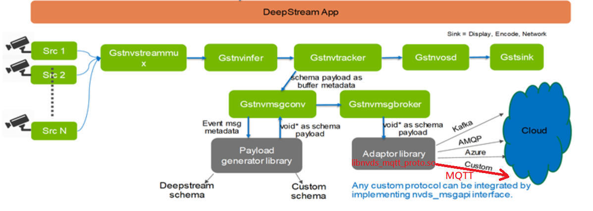
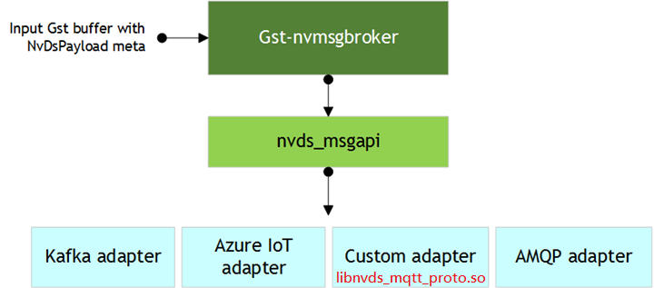
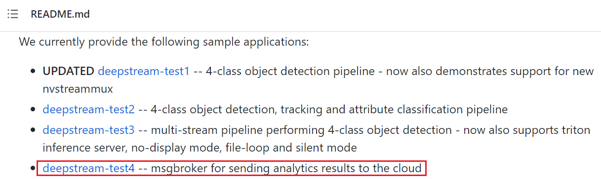
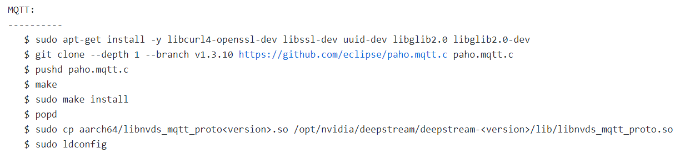
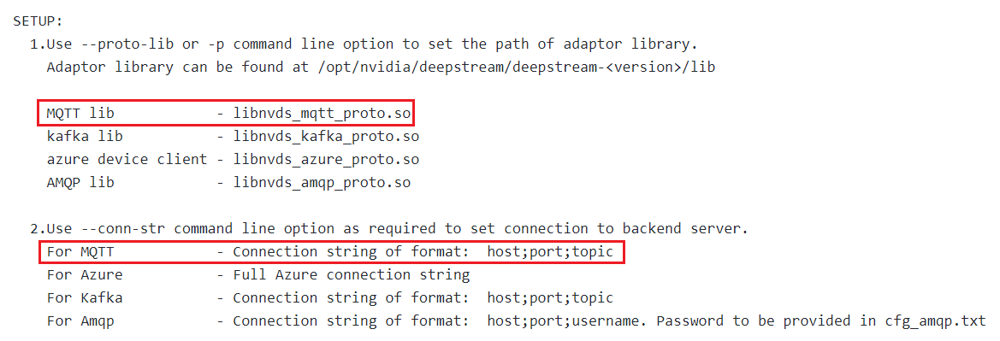
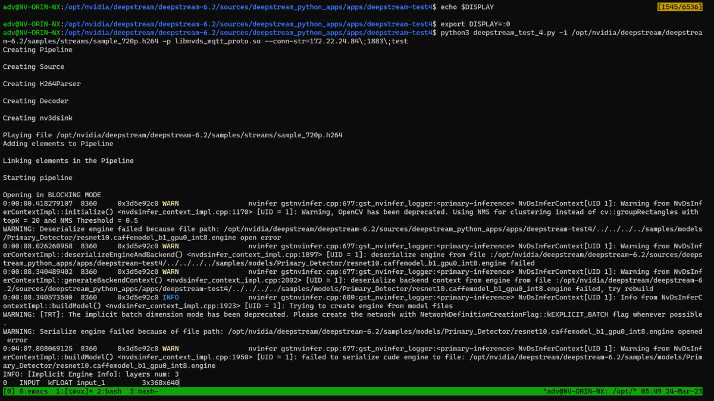
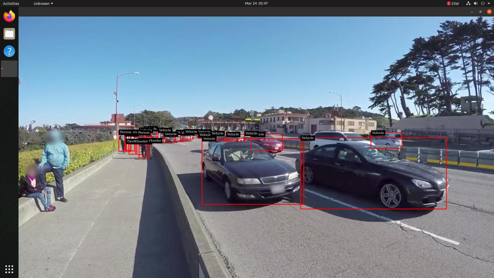
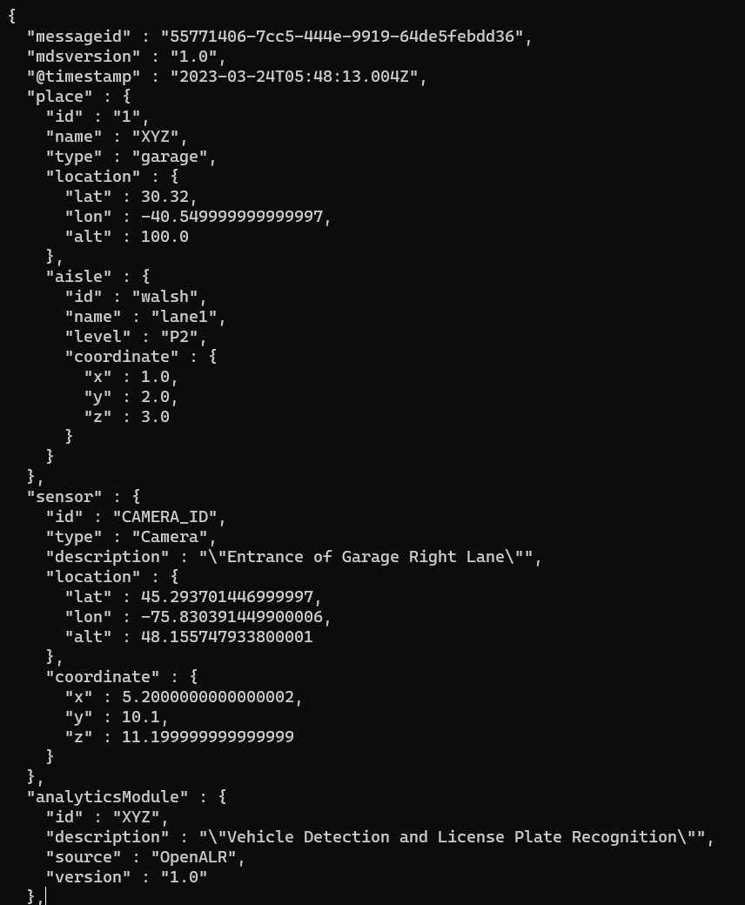

# README_mqtt
**DeepStream nvds\_msgapi MQTT Adapter Usage**
----------------------------------------------

### **Revision History**

|     |     |     |     |
| --- | --- | --- | --- |
| **0.3** | **Date** | **Revision** | **Description** |
|     | 2023/3/24 | 0.1 | initial version |
|     | 2023/4/6 | 0.2 | Run deepstream-test4 example for MQTT messaging |
|     | 2023/4/11 | 0.3 | *   II. Messaging Function Block<br>*   V.1.4.4 Execution console log |

* * *

### **I. Purpose**

On NVIDIA Jetson device , we provides a python example to show how to use the gst-nvmsgbroker plugin MQTT protocol adapter provided in DeepStream 6.2. The application framework is based on github project NVIDIA-AI-IOT / deepstream\_python\_apps. We choose deepstream-test4 to demonstrate how to use the MQTT protocol adapter.

* * *

### **II. Messaging Function Block**

We provide MQTT adaptor `**libnvds_mqtt_proto.so**` for MQTT protocol, integrated by implementing the nvds\_msgapi interface. Gst-nvmsgconv/nvmsgbroker metadata generation and messaging to cloud are explained by Figure 1.

#### Figure 1 DeepStream App adaptor library messaging to cloud



DeepStream messaging interface, `nvds_msgapi`, is provided to implement a custom protocol message handler and integrate it with DeepStream applications. Such a message handler, known as a protocol adapter, let us integrate DeepStream applications with backend data sources, such as data stored in the cloud.

Our MQTT protocol adapter is based on Eclipse Paho MQTT C client library: [https://github.com/eclipse/paho.mqtt.c](https://github.com/eclipse/paho.mqtt.c)

Figure 2 show the relationship among Gst-nvmsgbroker, nvds\_msgapi and protocol adapters.

#### Figure 2 DS plugin gst-nvmsgbroker nvds msgapi



* * *

### **III. NVIDIA-AI-IOT / deepstream\_python\_apps**

We leverage the official NVIDIA github project to demonstrate the use of the MQTT adapter.

*   [https://github.com/NVIDIA-AI-IOT/deepstream\_python\_apps](https://github.com/NVIDIA-AI-IOT/deepstream_python_apps)

* * *

#### **IV. What Documentation Modification We Did**

##### IV.1 Project Original README



*   Project README deepstream-test4 explanation is changed to:
    *   **deepstream-test4** -- msgbroker for sending analytics results to the cloud via MQTT, Azure(mqtt) IOThub, kafka and AMQP broker(rabbitmq)

##### IV.2 highlight deepstream-test4 README MQTT relatives

###### **IV.2.1 Dependencies**



###### **IV.2.2 Setup**



* * *

### **V. Run deepstream-test4 example for MQTT messaging**

#### V.1 deepstream-test4 MQTT messaging setup

##### **V.1.1 Prerequisites**

*   DeepStreamSDK 6.2
*   Python 3.8
*   Gst-python

##### **V.1.2 Dependencies**

```text-plain
$ sudo apt-get update
```

##### **V.1.3 MQTT adapter setup**

```text-plain
$ sudo apt-get install -y libcurl4-openssl-dev libssl-dev uuid-dev libglib2.0 libglib2.0-dev
$ git clone --depth 1 --branch v1.3.10 https://github.com/eclipse/paho.mqtt.c paho.mqtt.c
$ pushd paho.mqtt.c
$ make
$ sudo make install
$ popd
$ sudo cp aarch64/libnvds_mqtt_proto<version>.so /opt/nvidia/deepstream/deepstream-<version>/lib/libnvds_mqtt_proto.so
$ sudo ldconfig
```

##### **V.1.4 Execution command**

###### V.1.4.1 Command args

*   Use --proto-lib or -p command line option to set the path of adaptor library. Adaptor library can be found at /opt/nvidia/deepstream/deepstream-<version>/lib
*   Use --conn-str command line option as required to set connection to backend server.  
    For MQTT            - Connection string of format:  host;port;topic
*   Use --schema or -s command line option to select the message schema (optional).  
       Json payload to send to cloud can be generated using different message schemas.  
       schema = 0; Full message schema with separate payload per object (Default)  
       schema = 1; Minimal message with multiple objects in single payload.  
       Refer user guide to get more details about message schema.
*   Use --no-display to disable display.

###### V.1.4.2 Command syntax  
 `$ python3 deepstream_test_4.py -i <H264 filename> -p <Proto adaptor library> --conn-str=<Connection string> -s <0/1>`

###### V.1.4.3 Command example

The following command is under directory:  
 `/opt/nvidia/deepstream/deepstream-6.2/sources/deepstream_python_apps/apps/deepstream-test4/`

```text-plain
$ python3 deepstream_test_4.py -i /opt/nvidia/deepstream/deepstream-6.2/samples/streams/sample_720p.h264 -p libnvds_mqtt_proto.so --conn-str=172.22.24.84\;1883\;test
```

###### V.1.4.4 Execution console log



* * *

#### V.2 Runtime screenshot

##### Figure 3 Result Display



The command used to receive MQTT metadata:

```text-plain
$ mosquitto_sub -h 172.22.24.84 -t '#'
```

##### Figure 4 msgbroker sending analytics results via MQTT

